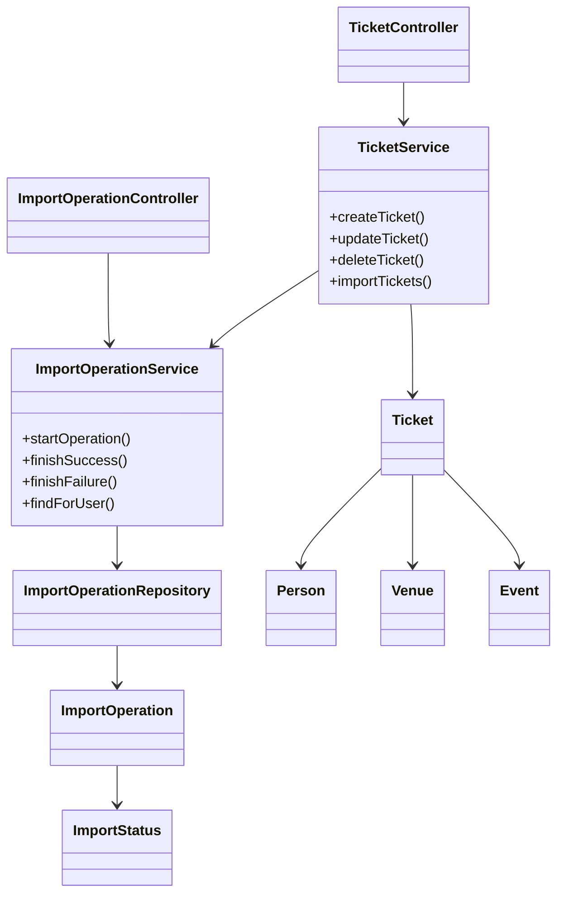
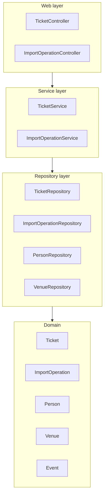

# Отчет по доработкам ИС Ticket Service

## Текст задания
- Добавить массовый импорт объектов из XML-файла с загрузкой через веб-интерфейс, проводить импорт транзакционно, выполнять валидацию согласно ограничениям предметной области и поддерживать вложенные объекты в одном запросе.
- Реализовать интерфейс отображения истории импорта: обычный пользователь видит только свои операции, администратор — все; показывать идентификатор, статус завершения, инициатора и число созданных объектов для успешных операций.
- Разработать JMeter-сценарий, имитирующий одновременную работу нескольких пользователей (создание, редактирование, удаление, импорт) и проверяющий корректность изоляции транзакций, в том числе при конкурирующих изменениях одних и тех же объектов и при проверке ограничений уникальности; скорректировать уровни изоляции при необходимости и обосновать изменения.
- Подключить БД через пул соединений HikariCP и зафиксировать параметры конфигурации пула в отчетах.
- Включить L2 JPA Cache на базе Ehcache с возможностью управлять логированием статистики его использования.
- Сохранять файлы импорта в файловом хранилище MinIO с возможностью скачивания из истории импорта и с обеспечением транзакционной целостности между загрузкой файла и вставкой данных в БД.

## UML-диаграммы классов и пакетов

## Исходный код
- Репозиторий: https://github.com/example/is-ticket-service (данный отчет подготовлен по текущему состоянию рабочей ветки).
- Ключевые артефакты:
  - Backend (Spring Boot): `is-ticket-service/`
  - Frontend (Angular): `is-ticket-frontend/`
  - План нагрузки JMeter и примеры: `docs/jmeter/`
  - Пример XML для импорта: `docs/sample-ticket-import.xml`

## Конфигурация пула соединений
Приложение использует `HikariDataSource` в качестве пула соединений. Основные параметры, примененные в `application.properties` и `application-prod.properties`:
- `spring.datasource.hikari.pool-name=ticket-service-pool` — идентификатор пула в логах.
- `spring.datasource.hikari.maximum-pool-size=10` — лимит одновременных подключений.
- `spring.datasource.hikari.minimum-idle=2` — минимальное число простаивающих соединений.
- `spring.datasource.hikari.connection-timeout=30000` — ожидание получения соединения (мс).
- `spring.datasource.hikari.idle-timeout=600000` — время жизни неиспользуемого соединения (мс).
- `spring.datasource.hikari.max-lifetime=1800000` — максимальный срок жизни соединения (мс) до перераздачи драйвером.
- `spring.datasource.hikari.validation-timeout=5000` — таймаут проверки соединения (мс).
- `spring.datasource.hikari.leak-detection-threshold=30000` — порог фиксации утечек соединений (мс).
- `spring.datasource.hikari.auto-commit=true` — режим автокоммита для получаемых соединений.

## Конфигурация L2-кэша JPA (Ehcache)
Включен второй уровень кеширования Hibernate через провайдер Ehcache (`JCacheRegionFactory`) с конфигурацией `ehcache.xml`:
- Общий шаблон `jpa-default`: TTI 30 минут, 1000 элементов в heap и 32 МБ off-heap для вспомогательных регионов.
- Шаблон `read-mostly`: TTL 60 минут, 2000 элементов в heap и 64 МБ off-heap — используется для сущностей `Person`, `Venue`, `Event`, `Ticket` и `ImportOperation`.
- Отдельно объявлены регионы `default-query-results-region` и `default-update-timestamps-region` для кеширования запросов и меток времени.

Кэширование включается свойствами `spring.jpa.properties.hibernate.cache.*`, а статистика Hibernate активируется через `spring.jpa.properties.hibernate.generate_statistics`, которая читает флаг `cache.stats.logging.enabled`. При включении флага аспекты логируют дельты попаданий/промахов/записей L2-кэша для сервисных методов, что помогает оценить эффективность кеша в рантайме.

## Хранилище импортных файлов (MinIO)
Для хранения загруженных XML-файлов используется MinIO через клиент `io.minio:minio`. Ключевые параметры в `application.properties` / `application-prod.properties`:
- `storage.minio.endpoint` — адрес MinIO (по умолчанию `http://localhost:9000`).
- `storage.minio.access-key` / `storage.minio.secret-key` — учетные данные доступа.
- `storage.minio.bucket` — целевой бакет (`ticket-imports`).
- `storage.minio.region` — регион, если требуется политикой MinIO/S3.

Сервис `MinioStorageService` гарантирует существование бакета, формирует уникальный ключ для каждого файла (`UUID/originalName`), загружает файл с указанным `content-type`, отдает поток для скачивания и выполняет компенсационное удаление при ошибках.

## Распределенная транзакция для импорта
Импорт теперь обернут в двухфазный бизнес-коммит:
1. **Фаза подготовки** — файл читается в память и загружается в MinIO. При недоступности MinIO импорт прерывается до взаимодействия с БД.
2. **Фаза фиксации** — после успешной загрузки парсится XML, выполняется валидация и атомарная вставка данных в БД (уровень изоляции `SERIALIZABLE`). При успехе операция импорта помечается `SUCCESS` с числом созданных объектов и ссылкой на файл; при любой ошибке операция помечается `FAILED`, а загруженный в MinIO файл компенсируется удалением.

Эта схема покрывает три требуемых сценария отказа:
- **Отказ файлового хранилища:** загрузка на фазе подготовки бросает исключение, БД не трогается.
- **Отказ БД:** исключение в транзакции приводит к rollback и удалению ранее загруженного файла.
- **Ошибка бизнес-логики между шагами:** любое неперехваченное `RuntimeException` после записи в MinIO удаляет объект и фиксирует неуспех операции.

## Параллельные запросы и согласованность
Нагрузочный сценарий JMeter продолжает проверять конкурентный импорт. Дополнительно к изоляции `SERIALIZABLE` для самого импорта, компенсационная логика с MinIO гарантирует отсутствие «подвешенных» файлов при конкурентных сбоях. Примеры ситуаций и обработка:
- **Два пользователя параллельно загружают файлы:** каждый получает собственный объект в бакете благодаря UUID-префиксу; транзакции БД изолированы, а история импорта отображает каждый файл со своим ID.
- **Параллельные импорты при временной недоступности MinIO:** фаза подготовки сразу завершает операции ошибкой, не создавая сущности и не оставляя записей в истории с ссылкой на несуществующие файлы.
- **Одновременная попытка создать конфликтующие вложенные объекты (Person по паспорту):** уровень изоляции `SERIALIZABLE` и проверки в сервисе сохраняют согласованность, а при откате соответствующий загруженный файл удаляется.

## Выводы
- Реализован транзакционный импорт XML с валидацией и поддержкой вложенных объектов, обеспечивающий атомарность при ошибках.
- Добавлен учет и отображение истории операций импорта с разграничением доступа по ролям.
- Проведен нагрузочный сценарий JMeter для проверки изоляции транзакций; уровни изоляции усилены для операций создания, обновления, удаления и импорта, а также для создания людей, чтобы избежать гонок и нарушений уникальности. Импорт дополнительно защищен бизнес-двухфазным коммитом с компенсацией файлов в MinIO.
